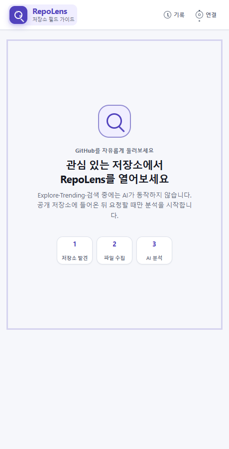
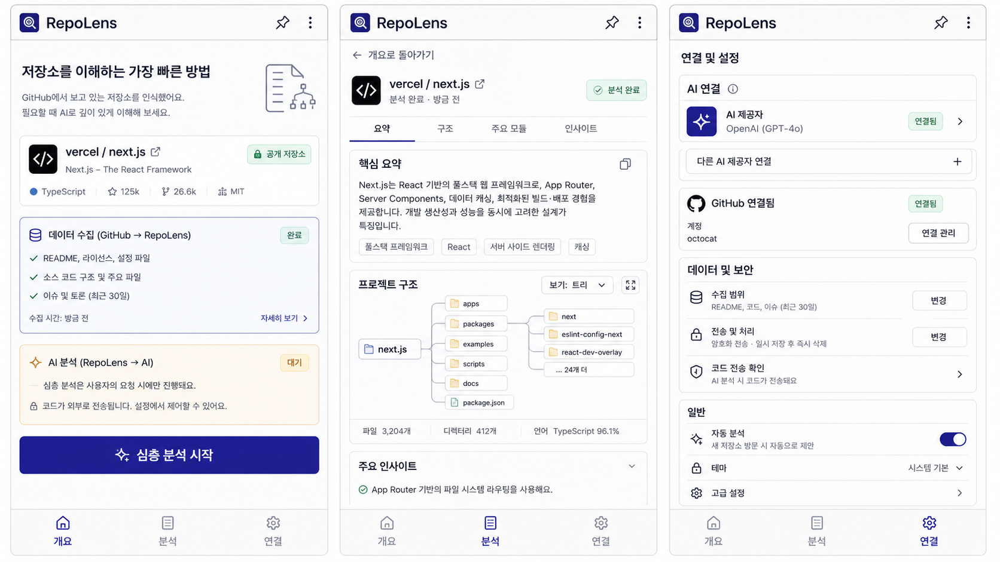

# RepoLens


**Browse GitHub first. Ask AI only when a repository earns your curiosity.**

RepoLens is a Chrome side-panel extension for understanding unfamiliar public
GitHub repositories without changing how you discover them. Explore, Trending,
and search stay AI-free. When you open a repository, RepoLens selects a bounded
set of files locally and sends only those excerpts to an OpenAI-compatible API
that you configure.

- **Bring your own AI:** use your own endpoint, model, and API key; RepoLens has
  no hosted AI relay.
- **Start small, then go deeper:** run a quick overview or expand directly to a
  locally selected deep bundle.
- **Inspect the evidence:** reports and source links are pinned to the exact
  commit that was analyzed.
- **Keep browsing deliberate:** repository code is never executed, and no AI
  call happens until you explicitly start one.

[Installation](#installation) · [Supported scope](#supported-scope) ·
[Privacy and security](#privacy-and-security) · [Limitations](#limitations) ·
[Community](#community-and-contributing)

## Developer Preview

RepoLens is usable as an MVP, but it is not yet a Chrome Web Store release or a
claim of complete codebase understanding. Expect manual installation, provider
compatibility edge cases, and changes to stored data or UI before a stable
release. Reports are model-generated interpretations of selected files, not a
security audit or proof of runtime behavior.

Current preview capabilities include:

- a TypeScript-authored Chrome Manifest V3 side panel with a small, local build;
- public repositories and their default branch;
- quick and deep analysis paths with one AI request per run;
- encrypted AI connection presets and optional GitHub OAuth or PAT credentials;
- evidence-validated reports and a locally rendered conceptual Mermaid map;
- GitHub request caching, coalescing, cancellation, and commit-SHA pinning; and
- local analysis and follow-up history in IndexedDB.

## Installation

### Release ZIP

When a packaged preview is available, open the
[latest GitHub release](../../releases/latest), download the RepoLens extension
`.zip` asset, and extract it. Do not load the compressed file directly and do
not use GitHub's automatically generated source archive unless the release
notes explicitly say to do so.

1. Open `chrome://extensions` in Chrome 116 or newer.
2. Enable **Developer mode**.
3. Select **Load unpacked**.
4. Choose the extracted folder that directly contains `manifest.json`.

### Source checkout

Clone or download this repository, then build the unpacked extension:

```powershell
npm ci
npm run build
```

Use **Load unpacked** and select `build/extension`—the generated folder that
directly contains `manifest.json`. Do not select the repository root; Chrome
cannot execute the TypeScript source files directly.

### First run

1. Open a public GitHub repository and click the RepoLens toolbar action.
2. In **AI 연결 설정**, create the local encrypted vault with a unique master
   password of at least 12 characters.
3. Add an AI preset with a provider base URL, API key, exact model ID, and
   streaming preference, then select it.
4. Optionally connect GitHub to receive the higher authenticated REST API
   allowance. RepoLens still analyzes public repositories only.
5. Choose **빠른 분석 시작** or **바로 심층 분석**.

The master password cannot be recovered. Losing it requires resetting the
vault and entering the presets again; resetting also removes analysis history
whose opaque provider references belong to the old vault.

## How analysis works

RepoLens provides two explicit entry paths after you open a repository:

1. **Quick analysis** selects balanced anchor files such as the README,
   manifests, configuration, likely entry points, and representative source
   files. It makes one AI request. Its effective file limit is half the
   configured deep limit, rounded up and capped at eight.
2. **Deep analysis** reads anchors and expands the bundle locally before making
   one AI request. It can be started immediately; a quick report is not a
   prerequisite.

The deep selector follows resolvable relative JavaScript and TypeScript
imports, exports, dynamic imports, and `require` calls. It also considers exact
internal paths in `package.json` and `tsconfig`. URLs, external packages, paths
outside the repository, unsafe paths, and files absent from the pinned Git tree
are rejected. Remaining capacity is filled with balanced representative files.
This is evidence-oriented selection, not a complete dependency graph.

Expanding an existing quick report creates a separate deep report and makes one
additional AI request. The quick report remains available, and its generated
text is not reused as evidence for the deep prompt. Before expansion, RepoLens
checks that the default branch still points to the original commit. If it has
changed, expansion stops before fetching the tree or blobs and asks you to
analyze the new commit instead.

Each source file is capped at 24,000 characters, and repository input is capped
at 48,000 characters across files. The deep file limit is configurable from 1
to 32 files (16 by default). These bounds control input size; they do not imply
that every compatible provider has the same context window.

## Supported scope

| Area | Developer Preview support |
| --- | --- |
| Browser | Google Chrome 116+ and compatible Manifest V3 environments |
| Repositories | Public GitHub repositories, current default branch only |
| Source handling | Static text reading only; repository code is never executed |
| AI protocol | OpenAI-compatible `POST /chat/completions`, streaming or non-streaming |
| Provider transport | HTTPS, plus HTTP for loopback hosts only |
| Relationship expansion | Relative JS/TS references and exact supported config paths |
| Output | Evidence-linked report, follow-up answers, and a conceptual project map |
| Storage | Chrome-local encrypted presets; IndexedDB reports and public-source cache |

For OpenAI, use `https://api.openai.com/v1` as the base URL. RepoLens appends
`/chat/completions`. Other providers must implement the compatible request and
response shape. They must also allow requests from the extension origin through
CORS. RepoLens does not retry through a proxy after a CORS failure because that
could duplicate generation and cost. Chrome requests access to a provider
origin only after a user action.

Protocol compatibility does not guarantee that every model follows the report
schema equally well. Provider pricing, rate limits, retention, and training
policies remain the provider's responsibility.

## Interface preview

The screenshot below was captured from the unpacked `0.1.0` extension in a
fresh automated Chromium profile. It shows the idle discovery state before an
AI provider is configured; no API key or personal repository data is present.



### Design direction

The image below is a **design concept, not a screenshot of the current
extension**. It records the intended visual language; actual behavior and UI
should be evaluated from the installed Developer Preview.



## Privacy and security

### Data flow and trust boundary

- GitHub browsing and discovery do not invoke the AI provider. Starting an
  analysis sends the selected public repository excerpts and the analysis
  prompt to the active provider. A follow-up sends its question and stored
  analysis context to that provider.
- A connection test sends a small generated request but no GitHub source code;
  it may still consume provider quota.
- AI transport runs in the user-open trusted extension side panel, avoiding
  long-response loss from the Manifest V3 service-worker lifecycle. Credentials
  are not exposed to GitHub pages or content scripts.
- Repository files are untrusted data and cannot instruct the application.
  Source is sent as delimiter-escaped JSON without Base64 expansion.
- Model citations become links only after file-ID and line validation. Links
  point to the exact analyzed commit.
- The extension Content Security Policy allows packaged scripts only. Mermaid
  is loaded from the extension bundle, not a CDN.
- Analysis history stays in this Chrome profile's IndexedDB until you delete an
  item, clear all history, reset the vault, or remove the extension data.

The selected AI provider is outside RepoLens's trust boundary. The repository
owner does not receive the analysis request from RepoLens, but the AI provider
does. Review that provider's retention, training, billing, and privacy terms
before sending source excerpts.

### Encrypted AI and GitHub presets

The preset vault uses the browser Web Crypto API:

- PBKDF2-HMAC-SHA-256 with a random 16-byte salt and 600,000 iterations derives
  a 256-bit key from the master password.
- AES-256-GCM uses a fresh random 12-byte IV and a 128-bit authentication tag
  for every write. Envelope metadata is authenticated as additional data.
- After migration, `chrome.storage.local` retains only the versioned encrypted
  envelope and non-secret vault or migration state. The master password is
  never stored or sent to GitHub, the AI provider, or another service.
- While unlocked, derived key material and the current connection are
  necessarily available in memory and `chrome.storage.session`. Session storage
  is restricted to trusted extension contexts. Locking clears both records;
  Chrome also clears them when the extension session ends. The preview does not
  yet have a time-based automatic lock.

The encrypted envelope includes preset names, base URLs, model IDs, API keys,
streaming choices, GitHub OAuth or PAT credentials, and provider identity
history used for migrations. Analysis records refer to providers by random
opaque `providerRef` UUIDs rather than by URL or model ID.

The vault does **not** encrypt:

- public envelope and cipher parameters, salt, IV, vault IDs, or ciphertext
  length;
- provider-origin permissions that Chrome can display in extension settings;
- repository snapshots and excerpts, reports and maps, citations, follow-up
  questions and answers, or timestamps stored in IndexedDB; or
- anonymous public GitHub metadata, branch heads, trees, and decoded text blobs
  in the separate bounded cache.

This design protects saved preset contents from casual inspection and detects
envelope tampering. It does not defend against a compromised browser, malware,
DevTools access, or observation while the vault is unlocked. Anyone who obtains
the encrypted envelope can attempt offline password guesses, so use a strong,
unique master password.

### GitHub connection and request optimization

Automatic connection uses GitHub OAuth Device Flow and requests no scopes. The
user still approves a one-time code on GitHub; no client secret is included in
the extension. A fine-grained PAT is available as an advanced fallback. Both
methods are verified against `https://api.github.com/user`, and credentials are
sent only to fixed GitHub origins. Locking or resetting the vault removes the
active GitHub session credential.

This build uses a dedicated RepoLens GitHub OAuth App with Device Flow enabled;
its public Client ID is stored in `src/github-oauth-config.js`. A distributor
may replace it with an OAuth App they own. A browser extension must never
contain the OAuth client secret.

Anonymous public responses use a bounded IndexedDB cache. Repository metadata
is fresh for 15 minutes, a default-branch head for 3 minutes, and tree or blob
entries are keyed by repository and Git object SHA. The cache prunes from a
64 MiB high-water mark toward 48 MiB. Before staged object responses become
durable, RepoLens verifies that the repository is still public.

Authenticated responses stay memory-only, are isolated by credential-session
revision, expire within five minutes, and are capped at 16 MiB, pruning toward
12 MiB. They disappear when the background worker stops and never trust or
mutate extension-origin IndexedDB records. Credentials and response headers are
not cached. Cache failures fall back to GitHub transparently, and stale cache
formats are discarded on upgrade.

Collection accepts only a repository identity. The background worker resolves
the current default-branch commit and returns that exact snapshot, preventing a
caller from selecting an arbitrary Git object SHA. Concurrent requests are
coalesced where possible and analysis cancellation stops work that is no longer
needed.

The analysis file-limit preference is stored separately in
`chrome.storage.local`. The worker validates the 1–32 range again, and report
cache keys include depth, selector version, and file cap so a report created at
one scope is not silently reused at another.

On upgrade from the earlier session-only connection format, RepoLens imports
the active connection only when the user creates the vault. Legacy provider
metadata is removed after analysis-history migration succeeds. Do not assume
migration is complete while the UI reports it as pending.

### Safe project-map rendering

The model never supplies executable Mermaid source. It returns a bounded
`architectureGraph` JSON object based on selected evidence. RepoLens validates
node types, relationships, citations, text, and size—at most 10 nodes and 14
relationships—then generates a fixed `flowchart TD` subset.

Mermaid 11.16.1 is bundled locally and loaded lazily. Rendering uses strict
settings, and the generated SVG is accepted only after structural checks. An
accessible HTML list of the same nodes and relationships remains available if
Mermaid cannot render the map. The map is conceptual: it is not a complete file
tree, dependency audit, or proof of runtime behavior.

## Limitations

- Analysis quality is bounded by file selection, provider context limits, and
  model behavior. Important behavior can live in files that were not selected.
- Private repositories, arbitrary branches or commits, monorepo subproject
  selection, and complete dependency or security auditing are not supported.
- RepoLens does not execute, build, clone, or dynamically inspect repository
  code.
- JS and TS receive the richest local relationship expansion. Other languages
  currently rely mainly on balanced anchor and representative-file selection.
- Providers that block extension-origin CORS cannot be used directly. There is
  no hosted relay, proxy fallback, custom provider headers, or automatic
  failover.
- The encrypted vault has no credential recovery, cross-device sync, or timed
  automatic lock.
- Public result sharing, custom discovery ranking, and Chrome Web Store
  distribution are outside this Developer Preview.
- GitHub and AI provider quotas, downtime, policy changes, and billing remain
  external dependencies.

## Development

Node.js 22 or newer is required to install the pinned development dependencies,
compile the TypeScript sources, and run checks:

```powershell
npm ci
npm run build
npm run check
```

Load `build/extension` in Chrome after a successful build. The generated
JavaScript is not committed and release ZIPs contain only executable build
output and required static assets—not TypeScript sources, tests, source maps,
or `node_modules`. Keep changes compatible with the extension Content Security
Policy and do not introduce runtime CDN dependencies.

## Community and contributing

- Report reproducible bugs or propose focused features in
  [GitHub Issues](../../issues). Remove API keys, tokens, vault contents, and
  other secrets before attaching logs or screenshots.
- For a suspected vulnerability, prefer a private
  [GitHub security advisory](../../security/advisories/new) instead of a public
  issue. Never include working credentials.
- Pull requests are welcome when they preserve the privacy boundary, keep
  repository code non-executable, include relevant tests, and pass
  `npm run check`.

## License and provenance

RepoLens is licensed under `GPL-3.0-only`; see [LICENSE](LICENSE). AI transport
code is adapted from
[PocketRisu](https://github.com/PocketRisu/PocketRisu) at commit
`85a65f3137b45c8de4a8d21a9887be213b1ac3fc`. Mermaid 11.16.1 is included as an
unmodified local distribution under the MIT License together with its bundled
third-party components. Exact files, provenance, and license locations are recorded in
[THIRD_PARTY_NOTICES.md](THIRD_PARTY_NOTICES.md). RepoLens does not use
PocketRisu's `rpack` code.
